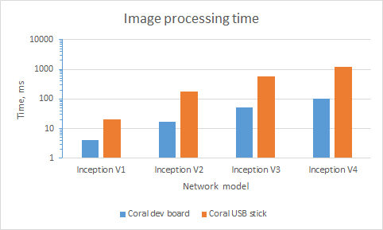
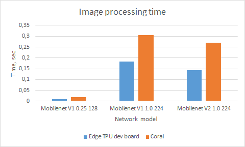
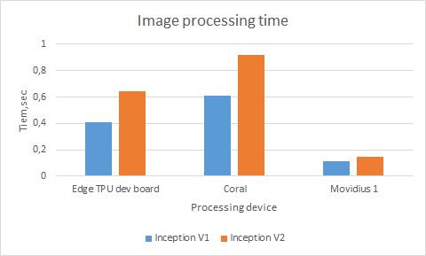
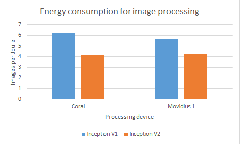
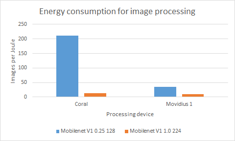

# Coral Evaluation  (draft version)

## Experiment objectives
Google announced Beta version of their Coral AI device a month ago.  We had a possibility to evaluate both implementations - USB stick and dev board. Also we want to compare Coral with Intel's Movidius 1 and Movidius 2 devices. Main idea of evaluation is to compare the performance when same neural network is executed.
## Obtaining internal neural network representation
The main problem to be solved is that Movidius and Coral use different internal representations of the networks. From the othpoint of view, Coral is in beta and supports only several NN architectures. Fortunately, the last version of OpenVINO (2019 R1) has the support of [Frozen Quantized Topologies](https://docs.openvinotoolkit.org/latest/_docs_MO_DG_prepare_model_convert_model_Convert_Model_From_TensorFlow.html) that Coral uses as well. Moreover, documentation contains recommendations for conversion of such networks in inference engine implementation used by Movidius hardware :

> "It is necessary to specify the following command line parameters for the Model Optimizer to convert some of the models from the list above: --input input --input_shape [1,HEIGHT,WIDTH,3]. Where HEIGHT and WIDTH are the input images height and width for which the model was trained."
>

Information about networks selected for comparison are summarized in Table 1.

*Table 1. Networks, selected for experiments.*

<table>
<tr>
    <th>Network</th>
    <th>Conversion parameters</th>
    <th>Result</th>
</tr>
<tr>
    <td><a href="http://download.tensorflow.org/models/inception_v1_224_quant_20181026.tgz">
    Inception V1
    </a>
    </td>    
    <td>
--input_model inception_v1_224_quant_frozen.pb 
		
--input input
		
--input_shape [1,224,224,3]
		
--data_type FP16 
	</td>
	<td>
	Converted
	</td>
</tr>
<tr>
	<td><a href="http://download.tensorflow.org/models/inception_v2_224_quant_20181026.tgz">
	Inception V2
	</a></td>	
	<td>
--input_model inception_v2_224_quant_frozen.pb
			
--input input
            
--input_shape [1,224,224,3]
            
--data_type FP16
    </td>
	<td>Converted</td>
</tr>
<tr>
	<td><a href="http://download.tensorflow.org/models/tflite_11_05_08/inception_v3_quant.tgz">Inception V3</a></td>	
	<td>
--input_model inception_v3_quant_frozen.pb
			
--input input
            
--input_shape [1,299,299,3]
            
--data_type FP16
    </td>
	<td>Converted</td>
</tr>
<tr>
	<td><a href="http://download.tensorflow.org/models/inception_v4_299_quant_20181026.tgz">Inception V4</a></td>	
	<td>
--input_model inception_v4_299_quant_frozen.pb
			
--input input
            
--input_shape [1,299,299,3]
            
--data_type FP16
    </td>
	<td>Converted</td>
</tr>
<tr>
	<td><a href="http://download.tensorflow.org/models/mobilenet_v1_2018_08_02/mobilenet_v1_0.25_128_quant.tgz">
	Mobilenet V1 0.25 128
	</a></td>	
	<td>
--input_model mobilenet_v1_0.25_128_quant_frozen.pb
			
--input input
            
--input_shape [1,128,128,3]
            
--data_type FP16
     </td>
	<td>Converted</td>
</tr>
<tr>
	<td><a href="http://download.tensorflow.org/models/mobilenet_v1_2018_08_02/mobilenet_v1_1.0_224_quant.tgz">
	Mobilenet V1 1.0 224
	</a></td>	
	<td>
--input_model mobilenet_v1_1.0_224_quant_frozen.pb
			
--input input
            
--input_shape [1,224,224,3]
            
--data_type FP16
    </td>
	<tdConverted></td>
</tr>
<tr>
	<td><a href="http://download.tensorflow.org/models/tflite_11_05_08/mobilenet_v2_1.0_224_quant.tgz">
	Mobilenet V2 1.0 224
	</a></td>	
	<td>
--input_model mobilenet_v2_1.0_224_quant_frozen.pb
			
--input input
            
--input_shape [1,224,224,3]
            
--data_type FP16
    </td>
	<td>Converted</td>
</tr>
<tr>
	<td><a href="http://download.tensorflow.org/models/object_detection/ssd_mobilenet_v1_quantized_300x300_coco14_sync_2018_07_18.tar.gz">
	MobileNet SSD v1 (COCO)
	</a></td>	
	<td>
--input_model tflite_graph.pb
			
--tensorflow_use_custom_operations_config path_to_ssd_support.json
            
--tensorflow_object_detection_api_pipeline_config pipeline.config
            
--input_shape [1,300,300,3]
            
--data_type FP16
    </td>
	<td>Conversion errors</td>
</tr>
<tr>
	<td><a href="http://download.tensorflow.org/models/object_detection/ssd_mobilenet_v2_quantized_300x300_coco_2019_01_03.tar.gz">
	MobileNet SSD v2 (COCO)
	</a></td>	
	<td>
--input_model tflite_graph.pb
			
--tensorflow_use_custom_operations_config path_to_ssd_v2_support.json
            
--tensorflow_object_detection_api_pipeline_config pipeline.config
            
--input_shape [1,300,300,3]
            
--data_type FP16
            
--reverse_input_channels
    </td>
	<td>
Conversion errors</td>
</tr>
<tr>
	<td><a href="http://download.tensorflow.org/models/object_detection/facessd_mobilenet_v2_quantized_320x320_open_image_v4.tar.gz">
	MobileNet SSD v2 (Faces)
	</a></td>	
	<td>
--input_model tflite_graph.pb
			
--tensorflow_use_custom_operations_config path_to_ssd_v2_support.json
            
--tensorflow_object_detection_api_pipeline_config pipeline.config
            
--input_shape [1,320,320,3]
            
--data_type FP16
    </td>
	<td>
Conversion errors
	</td>
</tr>
</table>

Raspberry Pi 3+ was selected as platform for Coral and Movidius evaluation. Taking into account that OpenVINO installation for Raspbian doesn't contain model optimizer, conversion was made on Win 10 notebook with the installed openVINO 2019 R1. Note that out of 10 neural networks selected for the comparison, only 7 were converted without errors. Information about errors was posted to Intel's forum and we are waiting for answer.

## Performance measuring

For chip performance measurement, we used the above mentioned  TensorFlow and TensorFlow Lite implementations of Inception V1, Inception V2, Inception V3, Inception V4, Mobilenet V1 0.25 128, Mobilenet V1 1.0 224, Mobilenet V2 1.0 224 networks. Test images were loaded to the stick for classification and measuring of image processing speed. 20 test images were used for experiment with 50 cycles run for data collection. Results are provided in Table 2.

Note that attempts to use Inception V3, Inception V4 and Mobilenet V2 1.0 224 on Movidius 1 resulted in unexpected errors, nevertheless that models were converted without any problems. Situation with Movidius 2 was more strange - none network was even possible to load into the chip, some assertion was involved during the loading process. Information about such Movidius 2 behavior was posted to [Intel's forum](https://software.intel.com/en-us/forums/computer-vision/topic/807826) and we are waiting for answer.

We also made the second experiment for Coral on dev board to avoid USB2 bias on the device speed (Raspberry Pi 3 B+ has only USB2, when Coral USB stick was designed for USB3). Performance increased in 3-10 times. Same networks were executed on Raspberry Pi's CPU for comparison. Details are shown in table 2 below, corresponding visualization in Figure 1 and 2.

 

*Table 2. Results of performance measuring.*

<table>
	<tr>
		<td rowspan="3">Network</td>
		<td colspan="5">Mean image processing time, sec</td>
	</tr>
	<tr>		
        <td>Coral  Dev board</td>
		<td>Coral USB stick</td>
		<td>Movidius 1</td>
		<td>Movidius 2</td>
		<td>CPU</td>
	</tr>
    <tr>		
        <td>INT8</td>
		<td>INT8</td>
		<td>FP16</td>
		<td>FP16</td>
		<td>INT8</td>
	</tr>
	<tr>
        <td>Inception V1</td>
		<td>0.004</td>        
        <td>0.021</td>        
        <td>0.113</td> 
        <td></td>
        <td>0.591</td>
	</tr>
	<tr>
		<td>Inception V2</td>
		<td>0.017</td>        
        <td>0.178</td>        
        <td>0.149</td> 
        <td></td>
        <td>0.835</td>
	</tr>
	<tr>
		<td>Inception V3</td>
		<td>0.052</td>        
        <td>0.590</td>        
        <td></td>
        <td>0.126</td>
        <td></td>        
	</tr>
	<tr>
		<td>Inception V4</td>
		<td>0.102</td>        
        <td>1.184</td>
        <td></td>
        <td>0.206</td>
        <td></td>        
	</tr>
	<tr>
		<td>Mobilenet V1 0.25 128</td>
		<td>0.001</td>        
        <td>0.004</td>
        <td>0.018</td>
        <td>0.014</td>
        <td>0.054</td>
        </tr>
	<tr>
		<td>Mobilenet V1 1.0 224</td>
		<td>0.003</td>
        <td>0.010</td>
        <td>0.069</td>
        <td>0.047</td>
        <td>0.411</td>
        </tr>
	<tr>
		<td>Mobilenet V2 1.0 224</td>
		<td>0.003</td>        
        <td>0.012</td>
        <td></td>
        <td>0.052</td>
        <td></td>        
	</tr>
</table>

 

*Figure 1. Image processing time comparison for Coral dev board and Coral USB stick.*

 

*Figure 2.  Image processing time comparison for Coral dev board, Coral USB stick, Movidius 1 and TensorFlow software implementation on CPU .*

Both TensorFlow Lite neural network file and compiled for Coral neural network file have the same extension - .tflite. However, when TensorFlow Lite neural network file is uploaded instead of compiled for Coral neural network file, we have performance degradation due to code execution on [CPU](https://coral.withgoogle.com/static/images/compile-tflite-to-edgetpu.png). None error messages are generated. 

Also, we tried to upload several network models into Coral simultaneously and found that starting from the second they are executed on  [CPU](https://coral.withgoogle.com/static/images/compile-tflite-to-edgetpu.png) too. 

Movidius allows executing several neural networks simultaneously on a single stick as well as usage of batch data processing.   

## Power consumption
We used XTARs USB Detector to measure power consumption during the computations. Measurements were made for Coral USB skick and Movidius 1 only, because it was impossible to measure Coral current  consumption on Dev board without changes in board design. Results are shown in Table3. We also made computations of energy consumption in terms of Images per Joule (see Figure 3).

*Table 3. Power consumption of Coral USB stick and Movidius 1.*

| Device     |  U,B |  I,A |
| :--------- | ---: | ---: |
| Coral      | 5.26 | 0.11 |
| Movidius 1 | 5.22 | 0.30 |

 

*Figure 3.   Energy consumption in Images per Joule for Coral USB stick  and Movidius 1.*

## Conclusions

According to the measurements results Coral USB stick is about 5 times faster than Movidius 1. Coral dev board is 8-28 times faster than Movidius 1 and about 3-10 times faster that Coral USB stick. From the other side, Movidius 1 is 3-6 times faster than TensorFlow network implementation on Raspberry Pi 3+ CPU.

Coral USB stick can process in  2-18 times more images per Joule of used energy than  Movidius 1.

Still, there are problems with the neural network conversions between TF and Movidius format, but new implementation of OpenVINO (2019 R1) has better networks support. 

Coral USB stick can process in  2-18 times more images per Joule of used energy than  Movidius 1.

Still, there are problems with the neural network conversions between TensorFlow and Movidius format, but new implementation of OpenVINO (2019 R1) has better networks support. 