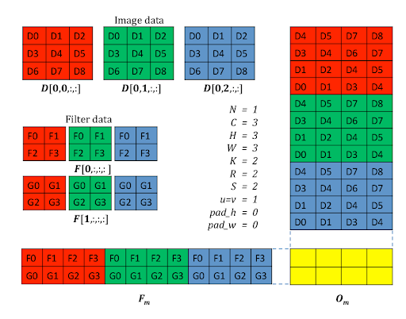
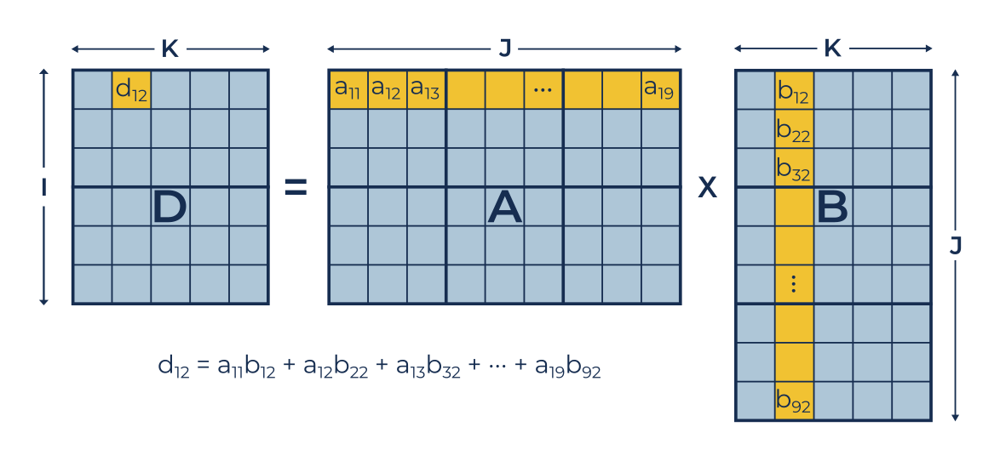
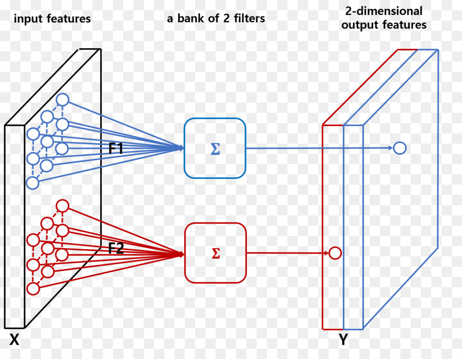

# FPGA-based Convolutional Neural Network acceleration

## Introduction

We leave in the century of fast changes when the flow of information is much bigger than we can process and analyze. That is the reason why real-time systems become more and more popular. Moor's law [[Ref](https://en.wikipedia.org/wiki/Moore%27s_law)] is not working anymore from 2019: it is physically impossible to make smaller transistors because of physics, on such small sizes the Relative Theory stops working, that is time for Quantum theory and another kind of computers.  
That is the reason why concurrent approaches become so popular - it is easy to make it horizontal-scalable. Multicore Processors, GPU's are very popular now, but they are not suitable for some approaches. That is why we are working with FPGA's. Maybe it can be a better platform for CNN?

### What is FPGA?
**FPGA** - Field Programmable Gate Array, one more integral circuit, projected to be reconfigured after manufacturing. Always is used for ASIC's (Application Specific Integrated Circuit) prototyping, but also it is a powerful platform for making own circuits [[Ref](https://numato.com/blog/differences-between-fpga-and-asics/#what-is-asic)]. The main pros of FPGA's are creating parallel processing in terms of DSP, own pipelines and reconfigurable logic.

### What is CNN?
**CNN** - Convolutional Neural Network, also known as ConvNet. It is a class of Deep Neural Networks, where primary (the most expensive) operation is Convolution. It is trendy in Image and Video processing for recognition classification and analysis problems. Also can be successfully used for time series analysis/predictions and natural language processing.  **Convolution** is an operation on functions, that express, how one modifies the shape of another one [[Ref](https://en.wikipedia.org/wiki/Convolution)].

## Solutions
So let us make a fast overview of the most popular approaches to run and accelerate CNN's on FPGA's

### OpenVINO
Terasic boards are the most popular FPGA's in the world, so if somebody has ever worked with FPGA, most likely he deals with Intel Terasic's chips, such as Cyclone or Stratix.  
**OpenVINO** - where VINO stands for Open Visual Inference and Neural network Optimization - a toolkit from Intel to "extend computer vision and non-vision workloads across Intel® hardware, maximizing performance" [[Ref](https://docs.openvinotoolkit.org/latest/index.html)]. It is developed for usage on heterogeneous systems, but only made by Intel®, so when it bought Terasic Inc, OpenVINO extends to supporting FPGA's as well. Personally I have no expertise with this instrument, so more details are in other our article [here](/movidius) and [here](/movidius-2).

### Mipsology
Mipsology product called **Zebra** - a deep learning compute engine for neural network interface [[Ref](https://mipsology.com)]. They promise that if the network was trained in any method, it could be run on CPU, GPU and FPGA with zero efforts without any changes inside the neural network and training process, what is more, it will be faster then before [[Ref](https://www.xilinx.com/video/events/mipsology-demonstrates-zebra.html)].

### Vitis AI
Vitis - SDK from Xilinx. More info [here](https://www.xilinx.com/products/design-tools/vitis.html).  

**Vitis AI** is a development platform for AI inference on Xilinx hardware platforms (FPGA, Cloud) [[Ref](https://www.xilinx.com/products/design-tools/vitis/vitis-ai.html)]. It supports models designed and trained on Caffee, TensorFlow, and PyTorch. The workflow is:  
Develop a model using any framework (but using only supporting layers and versions, that are described in the official documentation)
Train the model
Optimize, Compile and Quantize the model using Vitis AI tools
Run the model on the DPU (Deep learning Processing Unit) - a particular IP block for Xilinx boards with UltraScale+ chip on it. It is a part of Vitis AI.
That is it! The development process is simple and is designed for AI programmers as much as for Embedded programmers.
Performance (from official sites):
Optimizer: reduce the model complexity from 5 to 50 times. Loss: up to 1% of accuracy.
Quantizer: Float32 -> Int8 quantization to make the model faster and lighter. Loss: up to 1% of accuracy.
Performance (from experience):  
As far as it is impossible to deploy unsupported layers, by replacing Instance norm with the Batch norm, it managed to reduce the time in average from 32ms to 9ms, but the MAPE (mean absolute percentage error) is up to 10%. We think it is because of replacing such a vital layer but cannot check this assumption.

### PYNQ
PYNQ - open-source project from Xilinx, that makes possible to use Python language and libraries to run it on Xilinx platforms [[Ref](http://www.pynq.io/)]. PYNQ is usually used for developers, who want to make a fast test of their solutions on FPGA without programming on C++. There are eight officially supported boards, but as far as PYNQ is open-sourced, there are much more unofficially supported boards, only by the community.  
What is more - about CNN's - there are many examples of running CNN's on FPGA's ([for example here](https://github.com/awai54st/PYNQ-Classification)), but cannot even talk about acceleration - PYNQ is a very high-level approach, easy to use but tough to optimize. So let us look at low-level approaches.

## Low-level approaches for CNN's acceleration
Low-level programming is tightly connected with optimization and self-management of all resources - from memory to counting and reducing a real number of operations.  
Neural Networks are very heavy - they can be a hundred megabytes. Not every embedded device, especially FPGA, can contain and run such networks, only the best of them. And for what? Embedded devices used to be low-power, high-performance and highly-optimized. So how to accelerate CNN's for FPGA's?

### Lifehacks how to make faster

#### GEMM
As it was mentioned before, the most expensive operation in the convolutional networks is the convolution. To accelerate the calculations, we can use GEMM - General Matrix Multiply. The `im2col` operation can be used to make this.  
 
After the transformation of the kernels and input image, the convolution operation becomes simple matrixes multiplication, and after that, the repatch is required. There are many ways to accelerate matrixes multiplication.

For example, using CPU's SIMD registers (or even CUDA SIMT - single instruction multiple threads approach) vectors can be multiplied in one tact, and it can accelerate up to two times [[Ref](https://github.com/Myralllka/SOFTSERVE_CNN_convolution_2D)]
GEMM also can be used on the FPGA, and this approach is useful for CUDA, but not the best for the gate arrays.

#### Quantisation
Usually, CNN's weights are floating points, FP32 numbers. It is so to make accuracy as high as possible during training. However, is it necessary in the outgoing network? There are Binary neural networks, and their final weights are booleans, 0 or 1.  
FP is vital for training, but not in the outgoing network. Training time is not so important, as final execution accuracy, but add or multiply FP numbers is much slower, needs more power and hardware resources, then INT.   
That is why quantisation is a solution - we can convert FP32 to INT16/INT8 numbers, calculate the accuracy, latency and throughput and compare them. The result can be better if used not just rounding, but deep analysis with it.  
Every system has its approach to quantisation, Tensorflow has supervised and unsupervised approaches [[Ref](https://www.tensorflow.org/lite/performance/post_training_quantization)], Caffe has Ristretto  [[Ref](http://lepsucd.com/ristretto-cnn-approximation/)]. Vitis AI has its optimiser in pair with a quantiser. In all cases, we get some increase in latency with a decrease in accuracy.  
Important info - it is necessary to convert not only weights, but also layers, operations on that weights.

#### Parallelism
**Parallelism** or **parallel computing** is the approach to programming where one task is divided into a lot of small tasks and compute simultaneously. FPGA is one of the best examples of the hardware realisation of parallelism. As far as it is possible to make our horizontally scalable circuit, it is possible to scale it on the FPGA. Convolution is the operation that can be easily parallelised, as shown here: 
 
So we can either simultaneously apply multiple kernels to the image or simultaneously apply each kernel in a few positions. In both cases, we have parallelism that can be implemented in hardware using the FPGA.

### Different FPGA design types, caching and pipeline
One of the key challenges in designing high-performance FPGA-based CNN accelerator is to take full advantage of the on-chip computing resource. That is why the DSP, logic, caching and pipes are so important. Convolution, by itself, consists of MAC (multiply-accumulate operations). That is why authors of **DSP-Efficient Hardware Acceleration of Convolutional Neural Network Inference on FPGAs** article divided all possible inferences into three (and we add fourth, thair) groups of approaches.

#### SDConv
"Directly exploit the parallelism of the convolution computation in Spatial Domain by performing a massive number of MAC operations on a large array of DSP blocks in every cycle." It has a computational roof that is proportional to the number of MAC units and the operations frequency.

#### FDConv
Frequency Domain Convolution. "By transforming the data into frequency domain representation, the sliding window operation of SDConv turns into an inner product operation, which significantly reduces the number of the MAC operations required for convolution." Also, the authors presented a highly optimized FDConv, which "saves up to 73% of the MAC operation, and result in a theoretical speedup of 3.7x in peak performance".

#### SpConv
Sparse Convolution - "Scheme which saves MAC operation by directly pruning the CNN model. Unimportant weights (parameters) are forced to zero during the training or fine-tuning stages so that they no longer contribute to any computational workload and memory bandwidth during inference computation."

#### ABM-SpConv
So authors sad that the main problem is that all of this computations can not be achieved in real-life approaches, because they all utilised 97-100% DSP blocks, but in the applied problems such as robotics, autonomous vehicles -  the CNN is not the most important part, there also can be some units that need DSP blocks, so the results of computations can be far away from described. So they introduced a new kind of designs called Accumulate-Before-Multiply Sparse Convolution. The main idea is to decouple the accumulate and multiply operations, create a useful cache using the on-chip memory and create pipelines to make it faster.

##### Caching
the FPGA have much on-chip memory that is uniformly distributed on the board, that can be used as a cache or RAM and makes the latency less than accessing the flash memory. For example, the design of Intel® Cyclon 10
 [[Ref](https://www.intel.co.jp/content/dam/altera-www/global/en_US/documentation/rqk1517250959424/ezd1517849810689.png)]  
So the on-chip memory can be used in different ways, and in the case of the ABM-SpConv, they use the memory to cache the results of multiplications and number of each multiplication in specific tables, that helps to accelerate the final inferences.

##### Pipelines
The pipeline is one more powerful feature that is often used for the low-level optimizations on the hardware. Pipelines help to reduce the number of memory accesses by using only on-chip memory and DSP blocks. It is a streaming approach to programs developing.

#### Strassen-Winograd algorithm
It is the fastest of known matrix multiplication algorithms. If naïve matrix multiplication takes about O($`n^3`$), this algorithm can reduce the time to O($`n^{2.3754}`$). The main idea behind is to replace the multiplications with additions by different transformations. Details are well described in appendix A [here](https://www.mdpi.com/1999-4893/12/5/112/pdf).
