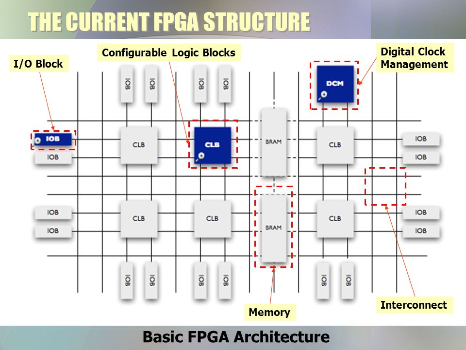
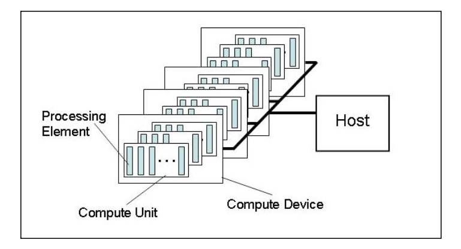
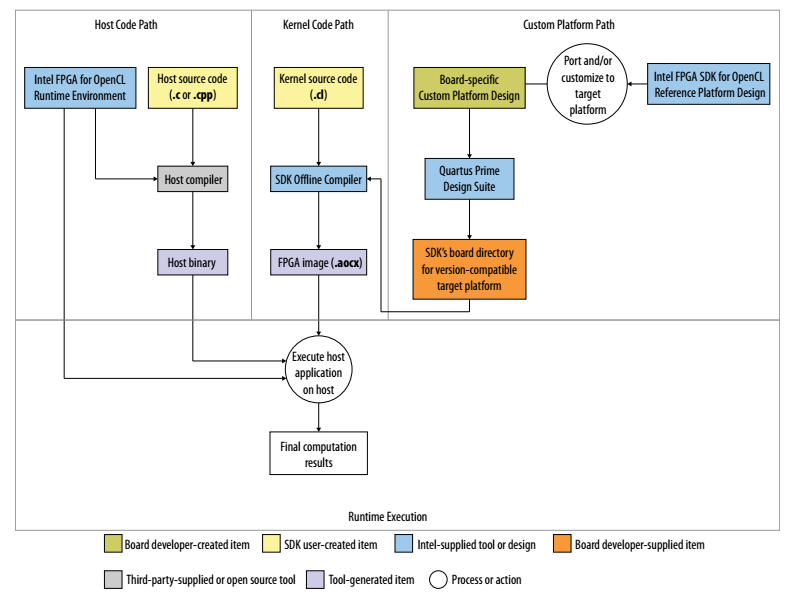
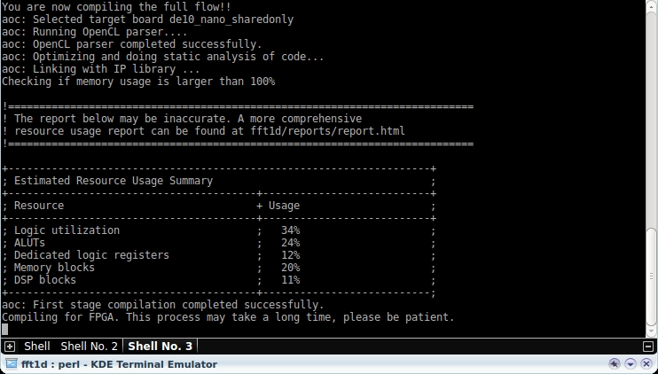
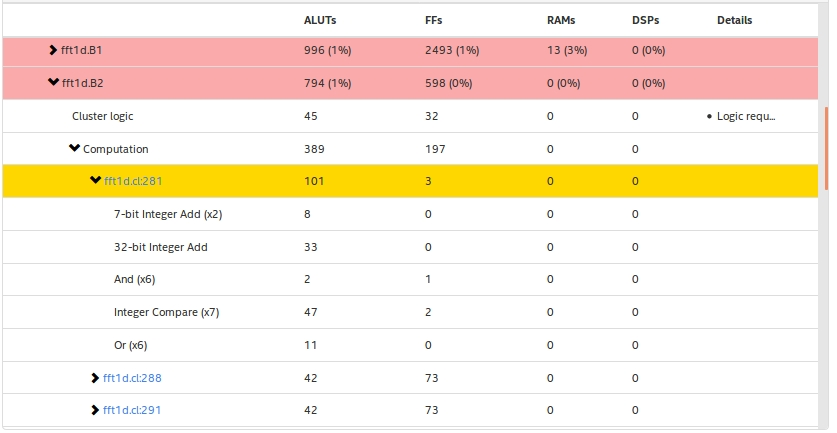
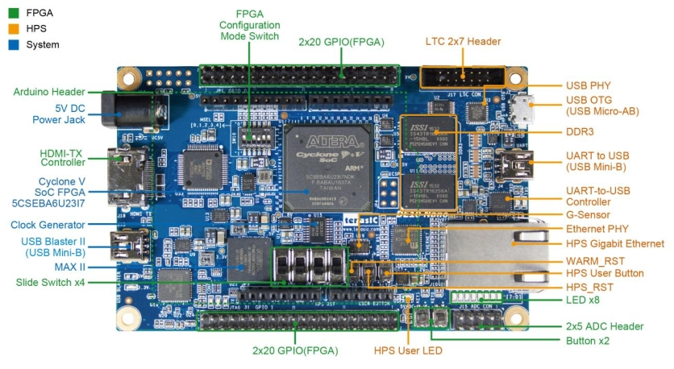

# FPGA development using OpenCL

Abstract: FPGAs are now treated as promising hardware accelerators for modern calculations required by AI or similar tasks, when large amount of data should be processed in a short time. DE10-Nano FPGA SoC with Cyclone V FPGA from Intel was used for our experiment. To essentially speed up the FPGA development OpenCL framework for heterogeneous programming was selected. Recently offered idea on heart rate calculation from just taking photo of the human forehead was used to evaluate the FPGA performance. Even though the considered task was not the best choice to highlight the FPGA advantages, the decrease of the calculation time comparing to CPU performance was achieved. 

Keywords: FPGA, SoC, OpenCL, OpenCV, HR calculation, parallel computing, heterogeneous computing

# Abbreviations

|        |                                     |
|--------|-------------------------------------|
| FPGA   | Field Programmable Gate Array       |
| AI     | Artificial Intelligence             |
| SoC    | System on Chip                      |
| OpenCL | Open Computing Language             |
| OpenCV | Open Computer Vision                |
| CPU    | Central Processor Unit              |
| HR     | Heart Rate                          |
| GPU    | Graphical Processor Unit            |
| VHDL   | VHSIC Hardware Description Language |
| VHSIC  | Very High Speed Integrated Circuit  |
| DSP    | Digital Signal Processor            |
| ALUT   | Adaptive LookUp Table               |
| FFT    | Fast Fourier Transform              |
| ROI    | Region Of Interest                  |

# Introduction

FPGA – Field Programmable Gate Array – is an integrated circuit that can be programmed or reprogrammed to the required functionality after manufacturing. As the name implies, FPGA possesses the large number (much higher than normal CPU) of logic gates, so operations on data can be done in parallel, thus, significantly increasing the computation speed. In other words, FPGA can be thought of as some kind of “soft” hardware – a hardware which can be re-tailored for the specific task whenever such a need appears.
Due to their qualities, FPGAs are getting popular as hardware devices enabling to speed up calculation and often to reduce the power consumption as well. FPGAs are claiming now to successfully challenge GPUs which until the recent times were considered to be primary hardware accelerators. One of the most important advantages FGPAs have over GPUs is the just mentioned flexibility – FPGAs can be re-tailored on-the fly to suit the specific problem needs.
Historical approach to FPGA programming consists in using the sophisticated and time-consuming Verilog and VHDL hardware definition languages. In recent times, however, a number of toolkits emerged making a process of FPGA programming easier and less time consuming. The most known and powerful of them are High Level Synthesis (HLS) and Open Compute Language (OpenCL). These both toolkits open an opportunity for the software engineers to write a custom logic without getting deep into FPGA intrinsics. We will consider here in more detail one of these toolkits, namely, OpenCL – a new industry standard for the task-parallel and data-parallel heterogeneous computing on a variety of modern CPUs, GPUs, DSPs and FPGAs.
OpenCL allows to write code only once for all the platforms, devices and vendors. Moreover, within the OpenCL there is no need to use hardware definition languages. Instead, code can be written in pure C (or C++) language and then OpenCL takes over a task on converting it to a final FPGA image. Obviously, this allows large number of the software engineers to get involved in FPGA programming.
There is also a disadvantage. Since FPGA code writing is performed “behind the scenes” and programmer cannot control it explicitly, the OpenCL usage gives a feeling that something could be done better (optimized, for example). Practical experience often confirms this feeling. But still, OpenCL advantages comfortably overcome its drawbacks. 

# FPGA. Short overview

The basic FPGA elements are:

- configurable logic blocks
- registers
- interconnects
- input/output (IO) blocks
- memory

The Figure ([1](https://www.google.com/search?q=basic+fpga+architecture&client=ubuntu&tbm=isch&tbs=rimg:CZ3qy95-9DJ8IjiF1mvSRDBkwnT8dWcbdNbTIsjhA8GDs1ov_1_1gpz1l-t9MqCspBP2Js3iB0wfzg_1aD5JWB4TXN-aSoSCYXWa9JEMGTCEdFEdcgRHR0qKhIJdPx1Zxt01tMR0uTrZ9Xl-qYqEgkiyOEDwYOzWhHS5Otn1eX6pioSCS_1_1-CnPWX63EcNnZ9QbRkI8KhIJ0yoKykE_1YmwR2eazdZfBNUAqEgneIHTB_1OD9oBHQUokX1a53LioSCfklYHhNc35pEeuDhSeAHL9Z&tbo=u&sa=X&ved=2ahUKEwjlqo-ni9HeAhXNsaQKHW6uCLcQ9C96BAgBEBs&biw=1425&bih=885&dpr=1#imgrc=9PRKmzraO-O-VM:))
below shows the basic FPGA architecture. Configurable logic blocks are computational units. Registers and memory are responsible for data storage. Interconnects serve as wires and eventually IO blocks interface FPGA with the outside world. 
Number of logic blocks for even mediocre FPGAs may reach hundreds of thousands. Just for comparison, ordinary CPU has only a couple of dozens of such units. The same holds true for registers, namely, hundreds of thousands for FPGAs and only dozens for CPUs. 
It is clear, therefore, that potentially FPGAs have a huge advantage over the CPUs in terms of computation time because a large number of logic blocks allows running computations in parallel. If a task is subjected to parallelization then the computation time benefit can be substantial. 

Fig.1. Basic FPGA architecture.

# Conventional FPGA development flow

Described FPGA benefits stop looking so attractive due to FPGA development flow. It requires the special knowledge in electronics, schematics, is complicated enough and, what is probably the most important, takes a rather long time. 
What is called a compilation process in the context of conventional CPU programming is roughly split into two stages in FPGA programming. First, Verilog or VHDL code is compiled into the so-called register transfer logic (RTL). This is analogous to CPU compilation. Second, the synthesis process is launched to produce objects that will control logical blocks (gates) and fill registers and memories on FPGA. In fact, the synthesis process describes the logical gates, which will compose the system. The output format is typically an Electronic Design Interchange Format (EDIF) file.
So, whereas  the conventional CPU compilers produce bits to control the **fixed-gate patterns** (the microprocessor decoders, registers, arithmetic logic unit, and so on), in  FPGA programming, on the contrary, the gate patterns described by the program logic are not ready, they are to be **synthesized**. That is, in FPGA programming the logic gets synthesized, or mapped, into the logical gates, while in CPU programming the program logic is mapped into the fixed instructions using the ready multi-gate blocks. 
The above described process roughly corresponds to the conventional CPU compiling, whereas the process corresponding to the CPU linking is called placing and routing in the FPGA development flow. In fact, during that process the code produced at the previous stage should fit onto the specific FPGA board. An output of this time consuming process is a file in one of the formats ready to be loaded on FPGA.

In the table below CPU and FPGA development flow comparison is provided.

| Stage # | CPU                              | FPGA                                             |
|---------|----------------------------------|--------------------------------------------------|
| 1       | Architectural design             | Architectural design                             |
| 2       | Choice of language (C, C++)      | Choice of language (Verilog, VHDL)               |
| 3       | Program development              | Program development                              |
| 4       | Compiling program (*.dll, *.obj) | Compiling program                                |
| 5       |                                  | Synthesizing program (*.edif)                    |
| 6       | Linking program (*.exe)          | Placing and routing program (*.vo, *.sdf, *.ttf) |
| 7       | Loading program to ROM           | Loading program to FPGA                          |

*Table 1. CPU and FPGA development flow comparison.*

As it can be seen from the table, the FPGA development flow has only one extra stage – synthesis. Though there is formally only one difference, in real life the traditional FPGA programming is a much more complicated process, especially because of synthesizing and placing/routing stages.

# OpenCL as alternative 

OpenCL is a new open industry standard for the task-parallel and the data-parallel heterogeneous computing on modern CPUs, GPUs, DSPs and FPGAs. It is maintained by the non-profit technology consortium Khronos Group.  
So, what is offered by OpenCL? In short, it substantially simplifies the FPGA development because:

- C/C++ is used instead of Verilog/VHDL (stage 2 in the Table 1).
- Stages 5 and 6 are left to the specific tools, while traditional flow implies developer involvement

Both factors reduce the FPGA development time.

OpenCL is used for the heterogeneous systems consisting of CPUs, GPUs, DSPs, FPGAs. One of these devices is the host device. It is always CPU. The other devices are called the compute devices. Another CPU can also be a compute device. So, OpenCL supports “single host – multiple compute devices” model. 
Host development is made in C or C++. Compute devices are programmed in OpenCL C language based on C99, which, in fact, is a subset of C with minor modifications.
OpenCL main computing block is a kernel function running on the device. 
Consider vector addition example. Let the task be to add two vectors of length N. Below is OpenCL example code snippet:

__kernel void vectorAdd(__global  float *x, __global  float *y, __global float * z)

{
    
    // get index of the work item
    int index = get_global_id(0);

    // add the vector elements
    z[index] = x[index] + y[index];     
}

[Fig.2. OpenCL model with host and compute devices.](https://www.khronos.org/registry/OpenCL/specs/opencl-1.1.pdf)

# OpenCL development flow
To start OpenCL development the corresponding IDEs must be downloaded and installed. Development with the Intel FPGAs requires OpenCL itself and Quartus Prime Lite Design Suite. It is the minimal requirement with no licenses needed.
OpenCL development flow consists of two principal stages:
- Host development
- Compute device (FPGA) development

[Fig.3. OpenCL development flow in detail.](https://www.intel.com/content/dam/www/programmable/us/en/pdfs/literature/hb/opencl-sdk/aocl_programming_guide.pdf)

*Host* development is a well-known C/C++ programming. In fact, it reduces to calling specific API functions to configure, load and eventually run FPGA image.

*FPGA* development is a more complicated process. It is described in detail in the Figure. 3. It consists of the following stages:
1. Write source code in OpenCL language (file format – *.cl)
2. Compile it with OpenCL compiler (see Figure. 4. below). At this stage the ordinary error check is performed.
3. Deliver the compiled OpenCL code to Quartus Prime Design Suite. Also board the support package for the specific board is needed.
4. At this point a time consuming process of code placing and routing onto the specific FPGA starts. It corresponds to the stage 6 in Table 1.
5. The output of the above process is the final FPGA image in *.aocx format. This image will be used by host to launch FPGA.

Fig.4. OpenCL compilation process output.

Let us consider in more detail the item 2 in the list above, namely, the compilation process.  If no syntax or other errors are detected then the compilation itself is successful and OpenCL proceeds to reporting board’s resource usage summary. In the Figure. 4 one can see the example of such an output. Generally, it is estimated to fit on the board since Logic utilization parameter, calculated according to the specific formula by individual parameters, is 34%. Individual parameters are also comfortably below 100%. Namely, only 24% of ALUTs (adaptive look-up tables, the same as configurable logic blocks) and 12% of registers are utilized. This, however, is just an estimation and does not guarantee that the fitting and routing process that follow will end up successfully.
If you are FPGA and OpenCL newbie, however, you may see a stopper even at the estimation stage if you are reported of the resource over-usage, that is, above 100%. This means the start of the annoying iterative process of the resource usage optimization. It will last until the resource usage is lowered down below 100%.
Fortunately, apart from the brief estimation summary, OpenCL also generates very detailed report on the resource usage indicating the bottlenecks indicated and providing recommendations to avoid them as well as other obstacles on the way to optimized code. Example page with the detail report on the resource usage by individual lines of the code is shown in the following figure.

Fig.5. Example report page with details on resource usage.

In the column Details in the figure above useful advices to reduce resource usage are usually provided. In general, report is very profound and is a good guide on developing optimized as well as smart FPGA code.

  
# From theory to practice. De10-Nano FPGA SoC

The DE10-Nano Development Kit is a design platform built around the Intel System-on-Chip (SoC) Cyclone V FPGA. It integrates Cortex-A9 hard processor system (HPS) consisting of processor, peripherals and memory interfaces tied seamlessly with the Cyclone V FPGA fabric using a high-bandwidth interconnect backbone.
The DE10-Nano development board is equipped with high-speed DDR3 memory, analog to digital capabilities, Ethernet networking, and more. Though Cyclone V FPGA is not among leaders in terms of available resources (Arria 10, for example, has almost 10 times higher number of ALUTs) it is a quite suitable platform to start FPGA development and get deeper into the subject.
Tasks with highly parallel nature are quite attractive but rather predictable at the same time since this is just what FPGAs are expected to do very well – run parallel computations. Our goal was to learn and use both FPGA and OpenCL features that allow to get benefits even with not “parallel” problems so we decided to choose as a benchmark problem a regular computer vision task we’ve already implemented on laptop and which is not intrinsically parallel. Heart rate calculation just from small forehead region was chosen as such a problem. 

# Heart rate calculation on De10-Nano

Idea of the method consists in detection of tiny color changes in small forehead skin region due to blood pulsation. To get forehead skin image a simple camera is used  with no additional light source – only ambient light. Images are taken permanently, then they are filtered and subject to FFT processing. Eventually, heart rate is calculated.
Heart rate (HR) calculation by the method described above was initially implemented by R&D team on laptop. We decided to port it to DE10-Nano FPGA SoC - a potentially faster device with much smaller form factor.

[Fig.6. De10-Nano FPGA SoC.](https://www.intel.com/content/dam/altera-www/global/en_US/portal/dsn/42/doc-us-dsnbk-42-4302081511597-de10-nano-user-manual.pdf)

DE10-Nano has all periphery and interfaces needed for such a task (see Fig. 6). Namely, it has HDMI output and USB-OTG for camera connection. From a software point of view there were a couple of challenging tasks. 

- Linux kernel on DE10-Nano. HR calculation application required suitable version of Linux kernel supporting LXDE (Lightweight Desktop Environment). Linux kernel supplied with DE10-Nano SDK had not supported LXDE. Like with host  application, a number of efforts were needed to get Linux kernel up and running. The biggest problem was to agree Linux kernel with OpenCL driver responsible for HPS – FPGA communication. 

- Host application.  A challenge was to build host application on DE10-Nano combining OpenCL and OpenCV since little was made so far in this field. After a number of investigations and attempts a host application was eventually built. A noticeable thing was that it appeared easier to build it on DE10-Nano than on PC.

- FPGA application. It was built on PC and then transferred to DE10-Nano board.

# FPGA application in detail

HR calculation application consists of the following main stages:

- image taking
- image preprocessing (ROI extraction) 
- basic filtering
- FFT transform

We designed the application in such a way that FFT is performed on FPGA while HPS is responsible for other simpler tasks.

Intel offers several application examples for FPGA. We started this way, that is, using proposed FFT example. Taking example almost as it is with slight modifications led to frustration – compilation report signaled around 300% resource over-usage. From this moment on a long and painful process of getting FFT fit and run on DE10-Nano started. This process, however, taught us some OpenCL specifics and tricks. 
Eventually we managed to fit FFT on DE10-Nano. It became possible, along with a couple of smaller optimization tricks, due to:

- replacing all float point operations by fixed point ones
- replacing multiplication by additions whenever possible
- avoiding division whenever possible
- replacing multiplication/division of power two numbers by bit shifting

Moreover,  we managed to have FFT transform on FPGA running around 50% faster than on HPS because of applying the following techniques:

- loops unrolling
- data exchange between HPS and FPGA optimized by transferring larger data blocks
- using local to FPGA variables rather than global ones whenever possible

Taking into account that FFT transform is not parallel process intrinsically this can be treated as a good result. This holds true, however, for pure FFT calculations – with data transfer in and out FPGA the overall FPGA performance loses to HPS performance. 

# Conclusions 

DE10-Nano FPGA SoC was used for getting in touch with practical FPGA programming. DE10-Nano is positioned as a middle-class FPGA SoC widely used in university programs. To speed up and simplify the FPGA development process we used OpenCL.
The overall process of the FPGA development is definitely more complex than conventional processors development. It requires a number of IDEs and toolkits installed and deployed with the dependencies between them. Another challenge is combining different technologies (in our case, OpenCL and OpenCV on the SoC) into a final application.
A task for FPGA/OpenCL benchmarking which is not parallel intrinsically was intentionally selected. The aim was to check whether FPGA can override HPS for such tasks and learn OpenCL features which could make it possible.
DE10-Nano was benchmarked on HR calculation problem where FFT transform task was delegated to FPGA. Eventually the FFT was running on FPGA be around 50% faster than on HPS.
Globally, getting more familiar with OpenCL intrinsics and special features could help in creation competitive cutting-edge FPGA based applications.

# References

- [The OpenCL Specification. Version 1.1](https://www.khronos.org/registry/OpenCL/specs/opencl-1.1.pdf)
- [Programming Guide for Intel FPGA SDK for OpenCL](https://www.intel.com/content/dam/www/programmable/us/en/pdfs/literature/hb/opencl-sdk/aocl_programming_guide.pdf)
- [DE10-Nano User Manual](https://www.intel.com/content/dam/altera-www/global/en_US/portal/dsn/42/doc-us-dsnbk-42-4302081511597-de10-nano-user-manual.pdf)
   

Author: Taras Kurnytskyi