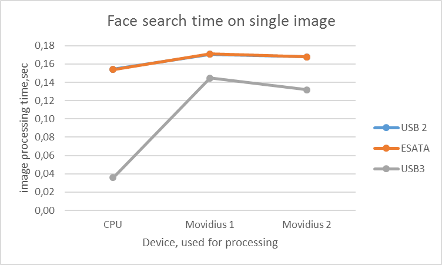
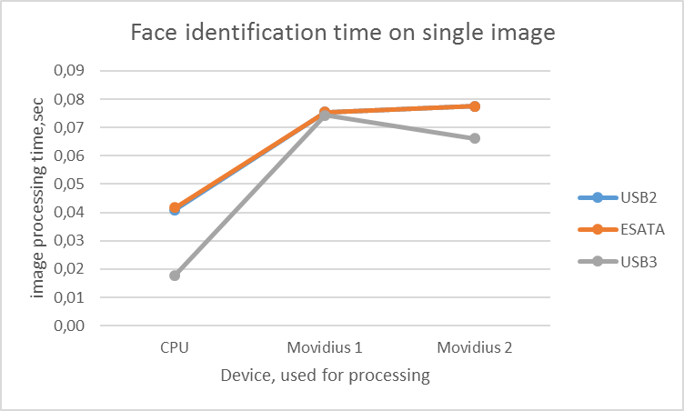
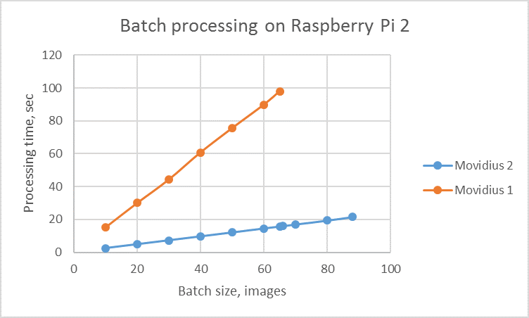
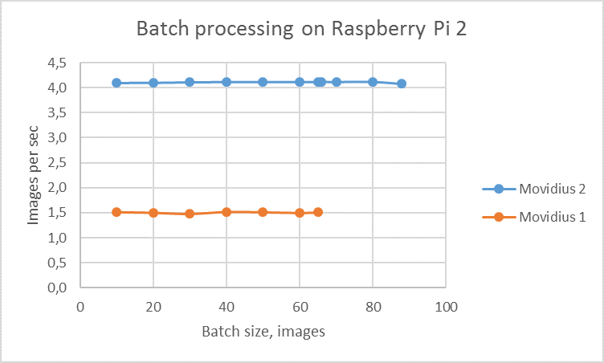
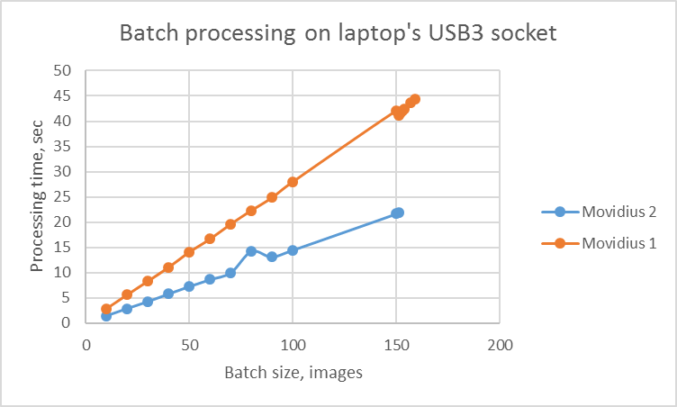
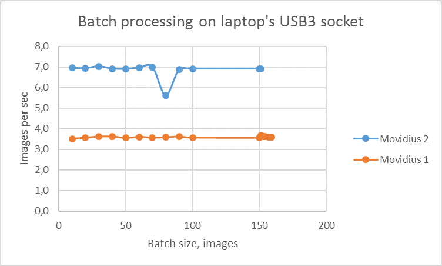

# Movidius 2 evaluation

## Objective of Research

Usage of neural networks to build software in the cloud is in the mainstream now. However, how to use them at the edge of the network in small IoT devices that do not have connection to the Internet? A year ago Intel made Movidius (a small USB stick with neuroprocessor chip) for solving such a task. R&D team tested the performance of this stick and compared it with GPU and FPGA devices [1], [2]. At the end of 2018 version 2 of Movidius was introduced, and we decided to evaluate it keeping in mind that we want to use it for face identification tasks in our novel solution.

## Software installation process

Movidius stick uses its own representation of neural networks that are transformed from network description formats of popular neural frameworks and loaded into the device using the special software. If the first version of Movidius used its own SDK for such purposes, the second generation uses a universal openVINO toolkit that also could be used to run neural networks on Intel’s CPU, GPU, and FPGA. Intel claims [3] that their framework works on  Ubuntu 16.04.3 LTS (64 bit), CentOS 7.4 (64 bit), Raspbian and Windows 10 (64 bit). The version 5 of the openVINO framework was successfully installed on Ubuntu 16.04.3, Windows 10 and last version of Raspbian using corresponding guides [4], [5], [6] as well as executed both C++ and Python types of examples.

Note that most of Python examples require the installation of OpenCV Python bindings that are absent on Windows platform just after installation. Two options are possible to solve this problem: 

- install them using standard pip; or 
- compile them from sources with Movidius support using guide [7]. After compilation, corresponding libraries should be copied manually.

Second variant is preferable because it supports Movidius hardware as a backend for OpenCV dnn implementation.

## Network preparation

Pretrained neural network should be transformed into an optimized Intermediate Representation (IR) of the model based on the trained network topology, weights, and bias values to run on the Movidius hardware. Model Optimizer is a cross-platform tool for such a transition. It supports Caffe, TensorFlow, MXNet or ONNX network descriptions as input data and produces two output files (.xml and .bin) of Intermediate Representation. It supports 24 layer types for Caffe, 64 layer types for TensorFlow, 50 layer types for MXNet and 46 for ONNX. All other layer types are interpreted as custom and developer can write his/her own code to support them. Details could be found in the corresponding documents [8], [9], [10], [11]. Likewise, the mentioned documents have detailed instructions for conversion of different types of topologies. Intermediate Representation of network could be stored in two formats FP16 or FP32 (use –data_type flag for selection format of output data). Both Movidius sticks support only FP16 format when CPU or GPU requires FP32 representation. For users familiar with Intel Movidius Neural Compute SDK for Movidius 1 stick, all differences in model preparation process are described in the separate document [12].

## Face recognition experiments on Movidius

Networks from the list of Intel supported ones [16] were selected to build the PoC for faces identification application for Movidius2 

- face-detection-adas-0001 network for face detection
- face-reidentification-retail-0095 for face identification

The face-detection-adas-0001 network takes input image in the format [BxCxHxW] of shape  [1x3x384x672]  where  B - batch size, C - the number of channels, H - image height, W - image width. Expected color order is  BGR. Network output is a blob with shape [1,1, N,7], where N is a number of detected bounding boxes. For each detection, the description has the format  [image_id, label, conf, x_min, y_min, x_max, y_max], where image_id - ID of the image in the batch, label - predicted class ID, conf - confidence for the predicted class, (x_min, y_min) - coordinates of the top left bounding box corner, (x_max, y_max) - coordinates of the bottom right bounding box corner.

The face-reidentification-retail-0095 network takes input image in format of [BxCxHxW] of shape [1x3x128x128]. Expected color order is RGB. Network output is a blob with shape [1,256], containing a row-vector of 256 floating point values.

openvino_fd_myriad.py example application from [6] was modified to work with two mentioned networks simultaneously. It uses OpenCV dnn object implementation to load and run the pretrained neural networks on Movidius. Both networks representation were successfully loaded into Movidius2 and worked together. To test the solution, images of people that have 15 photos at least in LFW (Labeled Faces in the Wild) database [17], were uploaded into Raspberry. For each photo, 256 dimension vector was calculated using a face-reidentification-retail-0095 neural network. After that, the distance between photos were calculated and the confusion matrix was built (Figure 1).

*Figure 1. Confusion matrix built for PoC application for face identification*

Looking at the confusion matrix, it becomes obvious that the face identification works. However, the quality of recognition is not high, because the faces should be aligned before recognition to achieve better results

The application was also run on laptops with Movidius 1 and Movidius 2 sticks connected to different socket types (USB2, ESATA, USB3) as well as on Intel's CPU. Results are shown in Figures 2 and 3. 

*Figure 2. Face search time for different devices and sockets*

*Figure 3. Face identification time for different devices and sockets*

As seen from the figures above, the performance of Movidius 1 and Movidius 2 is very close for the task of face detection for a single picture. Also, both sticks work quicker when connected to the USB3 socket. At that same time, Intel claims in press releases that Movidius 2 is 6-8 time better that Movidius 1. So, the next hypothesis for the research was formulated - better results should be received in the batch processing mode.

## Batch processing experiments on Movidius

*Figure 3. Batch processing results for Raspberry Pi*

*Figure 4. Batch processing results for laptop with USB3 socket*

It is worth mentioning that some data processing errors on Raspberry Pi happened for Movidius 2 on batch size starting from 89 images, when for Movidius 1 the same situation happened on the batch with 66 images. Data processing errors on the laptop computer with the connected Movidius 2 stick happened on batch size of 152 images, when for Movidius 1 – on 160 images. Mentioned errors could be caused by the serial port communication restrictions as well as by the amount of Movidius’ internal memory. Detailed methodology to the found network and data size restrictions was not established. 

## Sources List

1. [Andriy Bench. Movidius performance.](https://github.com/softserveinc-rnd/blog/blob/master/movidius/README.md)
2. [Andriy Bench. Will machines see with Movidius?]( https://www.softserveinc.com/en-us/blog/will-machines-see-with-movidius/)
3. [Intel Neural Compute Stick]( https://software.intel.com/en-us/neural-compute-stick)
4. [Install the Intel Distribution of OpenVINO toolkit for Linux]( https://software.intel.com/en-us/articles/OpenVINO-Install-Linux)
5. [Install Intel Distribution of OpenVINO toolkit for Windows 10]( https://software.intel.com/en-us/articles/OpenVINO-Install-Windows)
6. [Install the Intel Distribution of OpenVINO Toolkit for Raspbian OS]( https://software.intel.com/en-us/articles/OpenVINO-Install-RaspberryPI)
7. [Intel’s Deep Learning Inference Engine backend](https://github.com/opencv/opencv/wiki/Intel's-Deep-Learning-Inference-Engine-backend)
8. [Using the Model Optimizer to Convert Caffe Models]( https://software.intel.com/en-us/articles/OpenVINO-Using-Caffe)
9. [Using the Model Optimizer to Convert TensorFlow Models]( https://software.intel.com/en-us/articles/OpenVINO-Using-TensorFlow)
10. [Using the Model Optimizer to Convert MXNet Models]( https://software.intel.com/en-us/articles/OpenVINO-Using-MxNet)
11. [Using the Model Optimizer to Convert ONNX Models]( https://software.intel.com/en-us/articles/OpenVINO-Using-ONNX)
12. [Transitioning from Intel Movidius Neural Compute SDK to Intel Distribution of OpenVINO toolkit]( https://software.intel.com/en-us/articles/transitioning-from-intel-movidius-neural-compute-sdk-to-openvino-toolkit)
13. [ResFace101 pretrained network implementation](https://gist.github.com/iacopomasi/78c34643676843e6fba17a0f040bec43)
14. [ArcFace pretrained network](https://github.com/onnx/models/tree/master/models/face_recognition/ArcFace)
15. [FaceNet pretrained network]( https://drive.google.com/open?id=1R77HmFADxe87GmoLwzfgMu_HY0IhcyBz)
16. [Pretrained models]( https://software.intel.com/en-us/openvino-toolkit/documentation/pretrained-models)
17. [Labeled Faces in the Wild]( http://vis-www.cs.umass.edu/lfw/)
18. [Inference Engine Developer Guide]( https://software.intel.com/en-us/articles/OpenVINO-InferEngine)

## Appendix A. Single image processing data

| Socket |  Operation     | Device | Mean,sec |	Median,sec | STD,sec |
|:------:|:---------------:|:------:| --------:| -----------:| -------:|
| USB 2 |	Picture loading	| CPU	| 0,0002 |	0,0000 |	0,0002|
| | |  Movidius 1	| 0,0002	| 0,0000	| 0,0002|
| | |  Movidius 2	|0,0002|	0,0000|	0,0002|
| |Face search|	CPU	|0,1542 |	0,0081 |	0,1520|
| | |Movidius 1	| 0,1708 |	0,0008 |	0,1707 |
| | |Movidius 2	| 0,1679 |	0,0007 |	0,1679 |
| |Face loading	|CPU|	0,0000|	0,0000|	0,0000|
| | |Movidius 1	|0,0000|	0,0000|	3,0994|
| | |Movidius 2	|0,0000|	0,0000|	0,0000|
| |Face identification|	CPU	|0,0409|	0,0051	|0,0388|
| | |Movidius 1 |	0,0755 |	0,0015 |	0,0754|
| | |Movidius 2	|0,0776	|0,0003 |	0,0776|
| ESATA	| Picture loading|	CPU|	0,0002	|0,0000|	0,0002|
| | |Movidius 1	|0,0002	|0,0000	|0,0002|
| | |Movidius 2	|0,0002|	0,0000	|0,0002|
| | Face search|	CPU	|0,1540	|0,0087	|0,1519|
| | |Movidius 1	|0,1709	|0,0007	|0,1708|
| | |Movidius 2	|0,1678	|0,0008	|0,1676|
| |Face loading	|CPU	|0,0000	|0,0000	|0,0000|
| | |Movidius 1|	0,0000	|0,0000	|0,0000|
| | |Movidius 2	|0,0000|	0,0000	|0,0000|
| |Face identification|	CPU|	0,0418	|0,0129	|0,0388|
| | |Movidius 1	|0,0755|	0,0003|	0,0755|
| | |Movidius 2	|0,0775|	0,0003|	0,0775|
|USB3|	picture_loading|	CPU	|0,0001|	0,0002|	0,0000|
| | |Movidius 1	|0,0001	|0,0002	|0,0000|
| | |Movidius 2	|0,0001|	0,0002	|0,0000|
| |face_search	| CPU	| 0,0359	| 0,0048	| 0,0347|
| | |Movidius 1	| 0,1448|	0,0010|	0,1447|
| | |Movidius 2	|0,1318|	0,0005|	0,1319|
| |face_loading|	CPU	|0,0000	|0,0000|	0,0000|
| | |Movidius 1	|0,0000|	0,0000|	0,0000|
| | |Movidius 2	|0,0000	|0,0000	|0,0000|
| |face_identification	|CPU	|0,0178	|0,0025|	0,0174|
| | |Movidius 1|	0,0743	|0,0007	|0,0743|
| | |Movidius 2	|0,0660	|0,0006	|0,0659|
|----|	Face search	| Dlib|	0,0770|	0,0020|	0,0766|
| | Face identification	| Dlib|	0,0750	|0,0017|	0,0748|
| |Landmarks search	| Dlib|	0,0021	|0,0001|	0,0021|

## Appendix B. Batch processing data on Raspberry Pi

<table>
    <thead>
        <tr>
            <th rowspan=2>Color</th>
            <th rowspan=2>H</th>
            <th rowspan=2>W</th>
            <th rowspan=2> Batch-size</th>
            <th colspan=6>Time of batch execution on Movidius 2, sec</th>
        </tr>
        <tr>
            <th>1</th>
            <th>2</th>
            <th>3</th>
            <th>Mean</th>
            <th>Sec per Image</th>
            <th>Images per sec</th>
        </tr>
    </thead>
    <tbody align="right">
        <tr align="right">
            <td align="right">3</td>
            <td align="right">384</td>
            <td align="right">672</td>
            <td align="right">10</td>
            <td align="right">2,44</td>
            <td align="right">2,44</td>
            <td align="right">2,44</td>
            <td align="right">2,44</td>
            <td align="right">0,24</td>
            <td align="right">4,10</td>						
        </tr>
        	<td align="right">3</td>
        	<td align="right">384</td>
        	<td align="right">672</td>
        	<td align="right">20</td>
        	<td align="right">4,89</td>
        	<td align="right">4,87</td>
        	<td align="right">4,87</td>
        	<td align="right">4,88</td>
        	<td align="right">0,24</td>
        	<td align="right">4,10</td>
         <tr>
            <td align="right">3</td>
            <td align="right">384</td>
            <td align="right">672</td>
            <td align="right">30</td>
            <td align="right">7,30</td>
            <td align="right">7,30</td>
            <td align="right">7,29</td>
            <td align="right">7,30</td>
            <td align="right">0,24</td>
            <td align="right">4,11</td>
         </tr>
         <tr>
            <td align="right">3</td>
            <td align="right">384</td>
            <td align="right">672</td>
            <td align="right">40</td>
            <td align="right">9,73</td>
            <td align="right">9,69</td>
            <td align="right">9,71</td>
            <td align="right">9,71</td>
            <td align="right">0,24</td>
            <td align="right">4,12</td>
         </tr>
         <tr>
            <td align="right">3</td>
            <td align="right">384</td>
            <td align="right">672</td>
            <td align="right">50</td>
            <td align="right">12,19</td>
            <td align="right">12,14</td>
            <td align="right">12,11</td>
            <td align="right">12,15</td>
            <td align="right">0,24</td>
            <td align="right">4,12</td>
         </tr>
         <tr>
            <td align="right">3</td>
            <td align="right">384</td>
            <td align="right">672</td>
            <td align="right">60</td>
            <td align="right">14,63</td>
            <td align="right">14,55</td>
            <td align="right">14,54</td>
            <td align="right">14,57</td>
            <td align="right">0,24</td>
            <td align="right">4,12</td>
         </tr>
         <tr>
            <td align="right">3</td>
            <td align="right">384</td>
            <td align="right">672</td>
            <td align="right">65</td>
            <td align="right">15,83</td>
            <td align="right">15,74</td>
            <td align="right">15,76</td>
            <td align="right">15,78</td>
            <td align="right">0,24</td>
            <td align="right">4,12</td>
 		</tr>
        <tr>         
            <td align="right">3</td>
            <td align="right">384</td>
            <td align="right">672</td>
            <td align="right">66</td>
            <td align="right">16,07</td>
            <td align="right">16,01</td>
            <td align="right">15,95</td>
            <td align="right">16,01</td>
            <td align="right">0,24</td>
            <td align="right">4,12</td>
 		</tr>
        <tr>
            <td align="right">3</td>
            <td align="right">384</td>
            <td align="right">672</td>
            <td align="right">70</td>
            <td align="right">17,07</td>
            <td align="right">16,95</td>
            <td align="right">16,96</td>
            <td align="right">16,99</td>
            <td align="right">0,24</td>
            <td align="right">4,12</td>
 		</tr>
        <tr>
            <td align="right">3</td>
            <td align="right">384</td>
            <td align="right">672</td>
            <td align="right">80</td>
            <td align="right">19,48</td>
            <td align="right">19,37</td>
            <td align="right">19,38</td>
            <td align="right">19,41</td>
            <td align="right">0,24</td>
            <td align="right">4,12</td>
 		</tr>
        <tr>
            <td align="right">3</td>
            <td align="right">384</td>
            <td align="right">672</td>
            <td align="right">88</td>
            <td align="right">21,90</td>
            <td align="right">21,46</td>
            <td align="right">21,39</td>
            <td align="right">21,58</td>
            <td align="right">0,25</td>
            <td align="right">4,08</td>
 		</tr>
        <tr>
            <td align="right">3</td>
            <td align="right">384</td>
            <td align="right">672</td>
            <td align="right">90</td>
            <td align="right">ERROR</td>
            <td align="right">ERROR</td>
            <td align="right">ERROR</td>
            <td align="right">ERROR</td>
            <td align="right">ERROR</td>
            <td align="right">ERROR</td>
        </tr>
    </tbody>
</table>   

<table>
    <thead>
        <tr>
            <th rowspan=2>Color</th>
            <th rowspan=2>H</th>
            <th rowspan=2>W</th>
            <th rowspan=2> Batch-size</th>
            <th colspan=6>Time of batch execution on Movidius 1, sec</th>
        </tr>
        <tr>
            <th>1</th>
            <th>2</th>
            <th>3</th>
            <th>Mean</th>
            <th>Sec per Image</th>
            <th>Images per sec</th>
        </tr>
    </thead>
    <tbody align="right">        						
        <tr align="right">
            <td align="right">3</td>
            <td align="right">384</td>
            <td align="right">672</td>
            <td align="right">10</td>
            <td align="right">15,07</td>
            <td align="right">15,50</td>
            <td align="right">14,89</td>
            <td align="right">15,15</td>
            <td align="right">1,52</td>
            <td align="right">0,66</td>						
        </tr>
        	<td align="right">3</td>
        	<td align="right">384</td>
        	<td align="right">672</td>
        	<td align="right">20</td>
        	<td align="right">30,01</td>
        	<td align="right">30,05</td>
        	<td align="right">30,02</td>
        	<td align="right">30,03</td>
        	<td align="right">1,50</td>
        	<td align="right">0,67</td>        					
         <tr>
            <td align="right">3</td>
            <td align="right">384</td>
            <td align="right">672</td>
            <td align="right">30</td>
            <td align="right">44,14</td>
            <td align="right">44,66</td>
            <td align="right">44,08</td>
            <td align="right">44,29</td>
            <td align="right">1,48</td>
            <td align="right">0,68</td>             					
         </tr>
         <tr>
            <td align="right">3</td>
            <td align="right">384</td>
            <td align="right">672</td>
            <td align="right">40</td>
            <td align="right">59,58</td>
            <td align="right">61,65</td>
            <td align="right">61,15</td>
            <td align="right">60,79</td>
            <td align="right">1,52</td>
            <td align="right">0,66</td>             					
         </tr>
         <tr>
            <td align="right">3</td>
            <td align="right">384</td>
            <td align="right">672</td>
            <td align="right">50</td>
            <td align="right">75,26</td>
            <td align="right">76,43</td>
            <td align="right">75,08</td>
            <td align="right">75,59</td>
            <td align="right">1,51</td>
            <td align="right">0,66</td>             					
         </tr>
         <tr>
            <td align="right">3</td>
            <td align="right">384</td>
            <td align="right">672</td>
            <td align="right">60</td>
            <td align="right">90,10</td>
            <td align="right">90,05</td>
            <td align="right">89,48</td>
            <td align="right">89,88</td>
            <td align="right">1,50</td>
            <td align="right">0,67</td>             					
         </tr>
         <tr>
            <td align="right">3</td>
            <td align="right">384</td>
            <td align="right">672</td>
            <td align="right">65</td>
            <td align="right">97,32</td>
            <td align="right">96,88</td>
            <td align="right">99,73</td>
            <td align="right">97,98</td>
            <td align="right">1,51</td>
            <td align="right">0,66</td>             					
 		</tr>
        <tr>         
            <td align="right">3</td>
            <td align="right">384</td>
            <td align="right">672</td>
            <td align="right">66</td>
            <td align="right">ERROR</td>
            <td align="right">ERROR</td>
            <td align="right">ERROR</td>
            <td align="right">ERROR</td>
            <td align="right">ERROR</td>
            <td align="right">ERROR</td>
 		</tr>
        <tr>
            <td align="right">3</td>
            <td align="right">384</td>
            <td align="right">672</td>
            <td align="right">70</td>
            <td align="right">ERROR</td>
            <td align="right">ERROR</td>
            <td align="right">ERROR</td>
            <td align="right">ERROR</td>
            <td align="right">ERROR</td>
            <td align="right">ERROR</td>
 		</tr>
        <tr>
            <td align="right">3</td>
            <td align="right">384</td>
            <td align="right">672</td>
            <td align="right">80</td>
            <td align="right">ERROR</td>
            <td align="right">ERROR</td>
            <td align="right">ERROR</td>
            <td align="right">ERROR</td>
            <td align="right">ERROR</td>
            <td align="right">ERROR</td>
 		</tr>
        <tr>
            <td align="right">3</td>
            <td align="right">384</td>
            <td align="right">672</td>
            <td align="right">88</td>
            <td align="right">ERROR</td>
            <td align="right">ERROR</td>
            <td align="right">ERROR</td>
            <td align="right">ERROR</td>
            <td align="right">ERROR</td>
            <td align="right">ERROR</td>
 		</tr>
        <tr>
            <td align="right">3</td>
            <td align="right">384</td>
            <td align="right">672</td>
            <td align="right">90</td>
            <td align="right">ERROR</td>
            <td align="right">ERROR</td>
            <td align="right">ERROR</td>
            <td align="right">ERROR</td>
            <td align="right">ERROR</td>
            <td align="right">ERROR</td>
        </tr>
    </tbody>
</table>  

## Appendix C. Batch processing data on Laptop

<table>
    <thead>
        <tr>
            <th rowspan=2>Color</th>
            <th rowspan=2>H</th>
            <th rowspan=2>W</th>
            <th rowspan=2> Batch-size</th>
            <th colspan=6>Time of batch execution on Movidius 2, sec</th>
        </tr>
        <tr>
            <th>1</th>
            <th>2</th>
            <th>3</th>
            <th>Mean</th>
            <th>Sec per Image</th>
            <th>Images per sec</th>
        </tr>
    </thead>
    <tbody align="right">
        <tr align="right">
            <td align="right">3</td>
            <td align="right">384</td>
            <td align="right">672</td>
            <td align="right">10</td>
            <td align="right">1,41</td>
            <td align="right">1,45</td>
            <td align="right">1,45</td>
            <td align="right">1,44</td>
            <td align="right">0,14</td>
            <td align="right">6,96</td>            					
        </tr>
        	<td align="right">3</td>
        	<td align="right">384</td>
        	<td align="right">672</td>
        	<td align="right">20</td>
        	<td align="right">2,82</td>
        	<td align="right">2,87</td>
        	<td align="right">2,96</td>
        	<td align="right">2,88</td>
        	<td align="right">0,14</td>
        	<td align="right">6,94</td>        					
         <tr>
            <td align="right">3</td>
            <td align="right">384</td>
            <td align="right">672</td>
            <td align="right">30</td>
            <td align="right">4,25</td>
            <td align="right">4,27</td>
            <td align="right">4,28</td>
            <td align="right">4,27</td>
            <td align="right">0,14</td>
            <td align="right">7,03</td>
         </tr>
         <tr>
            <td align="right">3</td>
            <td align="right">384</td>
            <td align="right">672</td>
            <td align="right">40</td>
            <td align="right">5,90</td>
            <td align="right">5,81</td>
            <td align="right">5,64</td>
            <td align="right">5,78</td>
            <td align="right">0,14</td>
            <td align="right">6,92</td>             					
         </tr>
         <tr>
            <td align="right">3</td>
            <td align="right">384</td>
            <td align="right">672</td>
            <td align="right">50</td>
            <td align="right">7,15</td>
            <td align="right">7,30</td>
            <td align="right">7,28</td>
            <td align="right">7,24</td>
            <td align="right">0,14</td>
            <td align="right">6,90</td>            					
         </tr>
         <tr>
            <td align="right">3</td>
            <td align="right">384</td>
            <td align="right">672</td>
            <td align="right">60</td>
            <td align="right">8,55</td>
            <td align="right">8,54</td>
            <td align="right">8,76</td>
            <td align="right">8,62</td>
            <td align="right">0,14</td>
            <td align="right">6,96</td>            				
         </tr>
         <tr>
            <td align="right">3</td>
            <td align="right">384</td>
            <td align="right">672</td>
            <td align="right">70</td>
            <td align="right">10,00</td>
            <td align="right">10,18</td>
            <td align="right">9,82</td>
            <td align="right">10,00</td>
            <td align="right">0,14</td>
            <td align="right">7,00</td>            						 
 		</tr>
        <tr>         
            <td align="right">3</td>
            <td align="right">384</td>
            <td align="right">672</td>
            <td align="right">80</td>
            <td align="right">11,47</td>
            <td align="right">11,61</td>
            <td align="right">19,61</td>
            <td align="right">14,23</td>
            <td align="right">0,18</td>
            <td align="right">5,62</td>           						
 		</tr>
        <tr>
            <td align="right">3</td>
            <td align="right">384</td>
            <td align="right">672</td>
            <td align="right">90</td>
            <td align="right">13,13</td>
            <td align="right">13,14</td>
            <td align="right">12,92</td>
            <td align="right">13,06</td>
            <td align="right">0,15</td>
            <td align="right">6,89</td>            						
 		</tr>
        <tr>
            <td align="right">3</td>
            <td align="right">384</td>
            <td align="right">672</td>
            <td align="right">100</td>
            <td align="right">14,43</td>
            <td align="right">14,49</td>
            <td align="right">14,48</td>
            <td align="right">14,47</td>
            <td align="right">0,14</td>
            <td align="right">6,91</td>            						
 		</tr>
        <tr>
            <td align="right">3</td>
            <td align="right">384</td>
            <td align="right">672</td>
            <td align="right">150</td>
            <td align="right">21,70</td>
            <td align="right">21,81</td>
            <td align="right">21,57</td>
            <td align="right">21,69</td>
            <td align="right">0,14</td>
            <td align="right">6,91</td>            						
 		</tr>
        <tr>
            <td align="right">3</td>
            <td align="right">384</td>
            <td align="right">672</td>
            <td align="right">151</td>
            <td align="right">21,95</td>
            <td align="right">21,96</td>
            <td align="right">21,74</td>
            <td align="right">21,88</td>
            <td align="right">0,14</td>
            <td align="right">6,90</td>            						
        </tr>
        <tr>
            <td align="right">3</td>
            <td align="right">384</td>
            <td align="right">672</td>
            <td align="right">152</td>
            <td align="right">ERROR</td>
            <td align="right">ERROR</td>
            <td align="right">ERROR</td>
            <td align="right">ERROR</td>
            <td align="right">ERROR</td>
            <td align="right">ERROR</td>            
        </tr>   
        <tr>
            <td align="right">3</td>
            <td align="right">384</td>
            <td align="right">672</td>
            <td align="right">153</td>
            <td align="right">ERROR</td>
            <td align="right">ERROR</td>
            <td align="right">ERROR</td>
            <td align="right">ERROR</td>
            <td align="right">ERROR</td>
            <td align="right">ERROR</td>            
        </tr>   
        <tr>
            <td align="right">3</td>
            <td align="right">384</td>
            <td align="right">672</td>
            <td align="right">154</td>
            <td align="right">ERROR</td>
            <td align="right">ERROR</td>
            <td align="right">ERROR</td>
            <td align="right">ERROR</td>
            <td align="right">ERROR</td>
            <td align="right">ERROR</td>            
        </tr>
        <tr>
            <td align="right">3</td>
            <td align="right">384</td>
            <td align="right">672</td>
            <td align="right">157</td>
            <td align="right">ERROR</td>
            <td align="right">ERROR</td>
            <td align="right">ERROR</td>
            <td align="right">ERROR</td>
            <td align="right">ERROR</td>
            <td align="right">ERROR</td>            
        </tr>  
        <tr>
            <td align="right">3</td>
            <td align="right">384</td>
            <td align="right">672</td>
            <td align="right">159</td>
            <td align="right">ERROR</td>
            <td align="right">ERROR</td>
            <td align="right">ERROR</td>
            <td align="right">ERROR</td>
            <td align="right">ERROR</td>
            <td align="right">ERROR</td>            
        </tr> 
        <tr>
            <td align="right">3</td>
            <td align="right">384</td>
            <td align="right">672</td>
            <td align="right">160</td>
            <td align="right">ERROR</td>
            <td align="right">ERROR</td>
            <td align="right">ERROR</td>
            <td align="right">ERROR</td>
            <td align="right">ERROR</td>
            <td align="right">ERROR</td>            
        </tr>                
    </tbody>
</table>  

<table>
    <thead>
        <tr>
            <th rowspan=2>Color</th>
            <th rowspan=2>H</th>
            <th rowspan=2>W</th>
            <th rowspan=2> Batch-size</th>
            <th colspan=6>Time of batch execution on Movidius 1, sec</th>
        </tr>
        <tr>
            <th>1</th>
            <th>2</th>
            <th>3</th>
            <th>Mean</th>
            <th>Sec per Image</th>
            <th>Images per sec</th>
        </tr>
    </thead>
    <tbody align="right">
        <tr align="right">
            <td align="right">3</td>
            <td align="right">384</td>
            <td align="right">672</td>
            <td align="right">10</td>
            <td align="right">2,89</td>
            <td align="right">2,83</td>
            <td align="right">2,81</td>
            <td align="right">2,84</td>
            <td align="right">0,28</td>
            <td align="right">3,52</td>
        </tr>
        	<td align="right">3</td>
        	<td align="right">384</td>
        	<td align="right">672</td>
        	<td align="right">20</td>
        	<td align="right">5,68</td>
        	<td align="right">5,58</td>
        	<td align="right">5,55</td>
        	<td align="right">5,60</td>
        	<td align="right">0,28</td>
        	<td align="right">3,57</td>
         <tr>
            <td align="right">3</td>
            <td align="right">384</td>
            <td align="right">672</td>
            <td align="right">30</td>
            <td align="right">8,27</td>
            <td align="right">8,33</td>
            <td align="right">8,27</td>
            <td align="right">8,29</td>
            <td align="right">0,28</td>
            <td align="right">3,62</td>             					
         </tr>
         <tr>
            <td align="right">3</td>
            <td align="right">384</td>
            <td align="right">672</td>
            <td align="right">40</td>
            <td align="right">11,17</td>
            <td align="right">10,98</td>
            <td align="right">10,94</td>
            <td align="right">11,03</td>
            <td align="right">0,28</td>
            <td align="right">3,63</td>
         </tr>
         <tr>
            <td align="right">3</td>
            <td align="right">384</td>
            <td align="right">672</td>
            <td align="right">50</td>
            <td align="right">14,18</td>
            <td align="right">14,03</td>
            <td align="right">13,96</td>
            <td align="right">14,06</td>
            <td align="right">0,28</td>
            <td align="right">3,56</td>
         </tr>
         <tr>
            <td align="right">3</td>
            <td align="right">384</td>
            <td align="right">672</td>
            <td align="right">60</td>
            <td align="right">16,86</td>
            <td align="right">16,56</td>
            <td align="right">16,51</td>
            <td align="right">16,64</td>
            <td align="right">0,28</td>
            <td align="right">3,61</td>
         </tr>
         <tr>
            <td align="right">3</td>
            <td align="right">384</td>
            <td align="right">672</td>
            <td align="right">70</td>
            <td align="right">19,51</td>
            <td align="right">19,66</td>
            <td align="right">19,65</td>
            <td align="right">19,61</td>
            <td align="right">0,28</td>
            <td align="right">3,57</td> 
 		</tr>
        <tr>         
            <td align="right">3</td>
            <td align="right">384</td>
            <td align="right">672</td>
            <td align="right">80</td>
            <td align="right">22,66</td>
            <td align="right">21,98</td>
            <td align="right">22,32</td>
            <td align="right">22,32</td>
            <td align="right">0,28</td>
            <td align="right">3,58</td> 
 		</tr>
        <tr>
            <td align="right">3</td>
            <td align="right">384</td>
            <td align="right">672</td>
            <td align="right">90</td>
            <td align="right">25,15</td>
            <td align="right">24,56</td>
            <td align="right">24,89</td>
            <td align="right">24,87</td>
            <td align="right">0,28</td>
            <td align="right">3,62</td>           					
 		</tr>
        <tr>
            <td align="right">3</td>
            <td align="right">384</td>
            <td align="right">672</td>
            <td align="right">100</td>
            <td align="right">27,80</td>
            <td align="right">27,88</td>
            <td align="right">28,33</td>
            <td align="right">28,00</td>
            <td align="right">0,28</td>
            <td align="right">3,57</td> 
 		</tr>
        <tr>
            <td align="right">3</td>
            <td align="right">384</td>
            <td align="right">672</td>
            <td align="right">150</td>
            <td align="right">42,03</td>
            <td align="right">41,92</td>
            <td align="right">42,33</td>
            <td align="right">42,09</td>
            <td align="right">0,28</td>
            <td align="right">3,56</td> 
 		</tr>
        <tr>
            <td align="right">3</td>
            <td align="right">384</td>
            <td align="right">672</td>
            <td align="right">151</td>
            <td align="right">41,06</td>
            <td align="right">40,87</td>
            <td align="right">41,46</td>
            <td align="right">41,13</td>
            <td align="right">0,27</td>
            <td align="right">3,67</td>
        </tr>
        <tr>
            <td align="right">3</td>
            <td align="right">384</td>
            <td align="right">672</td>
            <td align="right">152</td>
            <td align="right">41,57</td>
            <td align="right">42,39</td>
            <td align="right">41,01</td>
            <td align="right">41,66</td>
            <td align="right">0,27</td>
            <td align="right">3,65</td>
        </tr>   
        <tr>
            <td align="right">3</td>
            <td align="right">384</td>
            <td align="right">672</td>
            <td align="right">153</td>
            <td align="right">41,89</td>
            <td align="right">42,22</td>
            <td align="right">42,17</td>
            <td align="right">42,09</td>
            <td align="right">0,28</td>
            <td align="right">3,63</td>             					
        </tr>   
        <tr>
            <td align="right">3</td>
            <td align="right">384</td>
            <td align="right">672</td>
            <td align="right">154</td>
            <td align="right">42,80</td>
            <td align="right">42,44</td>
            <td align="right">42,17</td>
            <td align="right">42,47</td>
            <td align="right">0,28</td>
            <td align="right">3,63</td> 
        </tr>
        <tr>
            <td align="right">3</td>
            <td align="right">384</td>
            <td align="right">672</td>
            <td align="right">157</td>
            <td align="right">44,59</td>
            <td align="right">43,33</td>
            <td align="right">43,16</td>
            <td align="right">43,69</td>
            <td align="right">0,28</td>
            <td align="right">3,59</td>
        </tr>  
        <tr>
            <td align="right">3</td>
            <td align="right">384</td>
            <td align="right">672</td>
            <td align="right">159</td>
            <td align="right">44,94</td>
            <td align="right">44,31</td>
            <td align="right">43,78</td>
            <td align="right">44,34</td>
            <td align="right">0,28</td>
            <td align="right">3,59</td>
        </tr> 
        <tr>
            <td align="right">3</td>
            <td align="right">384</td>
            <td align="right">672</td>
            <td align="right">160</td>
            <td align="right">ERROR</td>
            <td align="right">ERROR</td>
            <td align="right">ERROR</td>
            <td align="right">ERROR</td>
            <td align="right">ERROR</td>
            <td align="right">ERROR</td>
        </tr>                
    </tbody>
</table>  