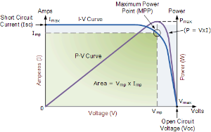
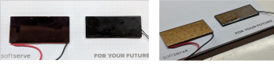
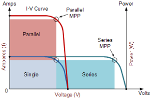
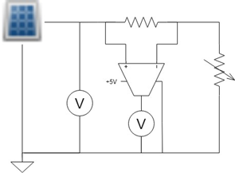
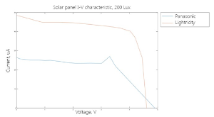

# Lightricity Solar Panels Evaluation 

## Executive Summary

People spend most of the time nowadays being inside the buildings. There is a lot of devices that are already installed and used as light control, heating, ventilation, and air conditioning (HVAC) subsystems, access control. The number of these devices increases and most of them require access to the wall power or batteries. The indoor solar panels allow to power devices having light inside the buildings as a power source. This can reduce maintenance costs for powering infrastructure inside the buildings with good lighted environment by replacing the batteries with the solar panels.

Recently SoftServe partnered with Lightricity, a company that developed the world best photovoltaic energy harvester for indoor light environments. We received samples of their product – photovoltaic module [EXL10-4V170](https://img1.wsimg.com/blobby/go/33b5bf3b-ee9e-480c-b78b-959e68adce90/downloads/1cec21vj9_822338.pdf), to evaluate their performance and compare them with the similar solutions on the market. As a result it was proved that Lightricity module was capable to provide more power than competitors in the same lighting conditions but with the smaller area.  
As initial tests show good results we plan to build our next power harvesting demo using Lightricity products.

## Overview and Test Setup

There are several vendors on the market that produce solar panels for indoor use. The difference between indoor and outdoor panels is that the first are able to provide power output with the low light intensity 50-200lux. Typical power that will be produced by the indoor panel will be in range of tenth uW and will depend on the actual panel size.  

*Figure 1. Current-voltage ( I-V ) characteristics of a typical silicon PV cell. Source – [National Instruments](http://www.ni.com/white-paper/7229/en/)*

The Figure above shows the standard I-V characteristic for solar panels, the product of current and voltage in each point forms P-V curve. This characteristic is taken with the fixed level of solar radiation that remains constant during characterization.  

There are several specific points on this chart: 
- Open Circuit Voltage – voltage output measured without load(I = 0) 
- Short Circuit Current  - maximal current that can be provided by the panel with the shorted outputs 
- Maximum Power Point - I and V combination that refers to maximum power output. Most of the advanced hardware platforms use Maximum Power Point Tracking or PWM technique to improve power transfer from the solar panel to the battery by controlling the output voltage and variating the impedance that matches the panel.   

In the solar panel typically there are number of cells connected in series or parallel to increase power output by: increasing voltage (series connection),  current (parallel connection) or both.

*Figure 2. Left – Panasonic, Right – Lightricity*

The power output of the solar panel is usually proportional to its actual dimensions. 

*Figure 3. Cells connection in solar panels. Source -  [National Instruments](http://www.ni.com/white-paper/7229/en/)*

During investigations of the indoor panels application we tested several panels provided by Lightricity [EXL10-4V170](https://img1.wsimg.com/blobby/go/33b5bf3b-ee9e-480c-b78b-959e68adce90/downloads/1cec21vj9_822338.pdf) and Panasonic [AC-1801](https://eu.mouser.com/datasheet/2/315/panasonic_AM-1801CA-1197162.pdf). 

The I-V Characteristics of the panels we used ANALOG DISCOVERY analyzer to measure current and voltage output of the panels. INA225 instrumental amplifier was used to measure voltage drop across resistor to precise current measurement. Shut was selected to 100Ohm with gain 50, as the purpose was to measure uA changes.

*Figure 4. Test setup*

##Test Results

For the test we used black box and LED lamp with the controlled intensity. The test was run with light Intensity of 200lux. Typical indoor lighting has a range of 50-300lux depending on the exact position in respect to the light source. The result can vary depending on the light source type as LED and luminescent lamps have different spectral characteristics. The results are depicted on the chart below for both panels. 

*Figure 5. Current-Voltage characteristics of DUTs with 200 Lux light intensity*

| Parameters\Panel          | Panasonic [AC-1801](https://eu.mouser.com/datasheet/2/315/panasonic_AM-1801CA-1197162.pdf) | Lightricity [EXL10-4V170](https://img1.wsimg.com/blobby/go/33b5bf3b-ee9e-480c-b78b-959e68adce90/downloads/1cec21vj9_822338.pdf) |
| :------------------------ | -----------------------------------------------------------: | -----------------------------------------------------------: |
| Dimensions, mm            |                                                  53.0 x 25.0 |                                                  50.0 x 20.0 |
| Area, cm 2     |                                                        13.25 |                                                         7.80 |
| Number of cells           |                                                         8.00 |                                                         8.00 |
| Open circuit voltage, V   |                                                         4.90 |                                                         4.61 |
| Short circuit current, uA |                                                        26.50 |                                                        48.50 |

According to the Figure 5. we conclude that Lightricity panel is capable to provide more power output with the smaller dimensions. The maximum power output of Lightricity panel [EXL10-4V170](https://img1.wsimg.com/blobby/go/33b5bf3b-ee9e-480c-b78b-959e68adce90/downloads/1cec21vj9_822338.pdf) in this test was 162uW which is close to the datasheet value (170uW). Our next step will be to build a network of connected devices that uses Lightricity panels as main power source for energy harvesting. 

