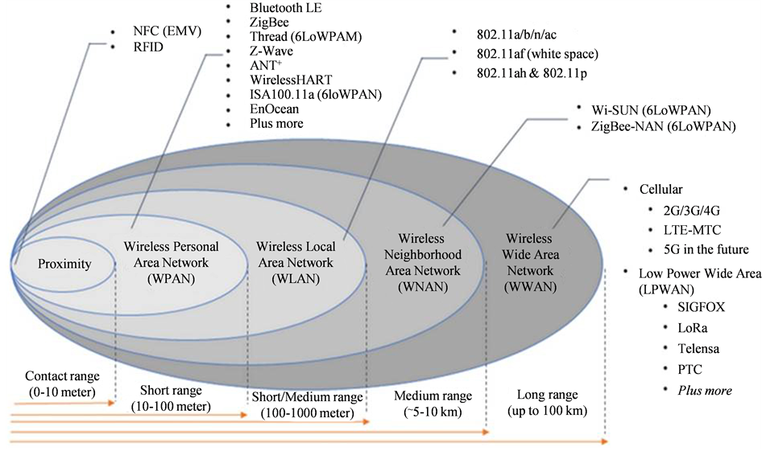
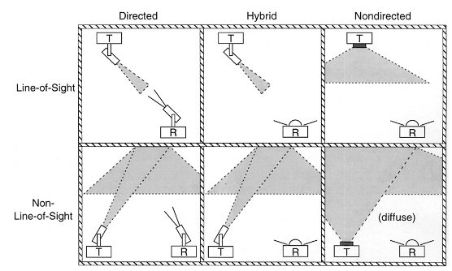

# Wireless Communication Between Devices 

## Executive summary

 

## Electromagnetic waves 

### Radio communication 

<table>
    <thead>
        <tr>
            <th colspan=2>Frequency range</th>
            <th>Notes</th>
    	</tr>
    </thead>
    <tbody>
    	<tr>
    		<td>6.765 MHz </td>
    		<td>6.795 MHz </td>
    		<td> </td>
    	</tr>
    	<tr>
    		<td>13.553 MHz </td>
    		<td>13.567 MHz </td>
    		<td> </td>
    	</tr>
    	<tr>
    		<td>26.957 MHz </td>
    		<td>27.283 MHz  </td>
    		<td> </td>
    	</tr>
    	<tr>
    		<td>40.66 MHz  </td>
    		<td>40.7MHz </td>
    		<td> </td>
    	</tr>
    	<tr>
    		<td>433.05 MHz </td>
    		<td>434.79 MHz  </td>
    		<td>Used only in Europe   (Region 1) Used only in Europe   (Region 1)  </td>
    	</tr>
    	<tr>
    		<td>902 MHz  </td>
    		<td>928 MHz  </td>
    		<td>Used only In America (Region 2)  </td>
    	</tr>
    	<tr>
    		<td>6.765 MHz </td>
    		<td>6.795 MHz </td>
    		<td> </td>
    	</tr>
    	<tr>
    		<td>2.4 GHz </td>
    		<td>2.5 GHz  </td>
    		<td> </td>
    	</tr>
    	<tr>
    		<td>5.725 GHz </td>
    		<td>5.875 GHz </td>
    		<td> </td>
    	</tr>
    	<tr>
    		<td>24 GHz </td>
    		<td>24.25 GHz</td>
    		<td> </td>
    	</tr>
    	<tr>
    		<td>61 GHz </td>
    		<td>61.5 GHz  </td>
    		<td> </td>
    	</tr>
    	<tr>
    		<td>122 GHz </td>
    		<td>123 GHz  </td>
    		<td> </td>
    	</tr>
    	<tr>
    		<td>244 GHz </td>
    		<td>246 GHz  </td>
    		<td> </td>
    	</tr>
    </tbody>
</table>

### Wireless Optical Communication

#### Infrared communication 

#### Lazer communication and free space optical communications 

#### Visible light communication 

##Mechanical waves 
### Acoustic communication 
### Ultrasonic communication 

## Other methods 

### Molecular communication 

## References 

1. Sensor technologies: healthcare, wellness, and environmental applications. McGrath M., Scanaill C.. Publisher: ApressOpen, 2014. 

2. Embedded systems for smart appliances and energy management. Grimm C., Neumann P., Mahlknecht S. Publisher: Springer, 2013 pp: 148. 

3. A Study of Efficient Power Consumption Wireless Communication Techniques/ Modules for Internet of Things (IoT) Applications. Mahmoud M., Mohamad A., Mahmoud M., Mohamad A. Advances in Internet of Things, 2016 vol: 06 (02) pp: 19-29 

4. Wireless infrared communications. Kahn J., Barry J. Proceedings of the IEEE, 1997 vol: 85 (2) pp: 265-298. 

5. Infrared Communication - Introduction of IR and It's Functionality. Date Accessed: 2019-07-17. URLS: www.elprocus.com/communication-using-infrared-technology/ 

6. Optical wireless communications - An emerging technology. Uysal M., Nouri H. International Conference on Transparent Optical Networks. Publisher: IEEE Computer Society, 2014.

7. A review of operational laser communication systems. Goodwin F. Proceedings of the IEEE, 1970.  vol: 58 (10) pp: 1746-1752  

8. Performance analysis of a car-to-car visible light communication system. Luo P., Ghassemlooy Z., Minh H., Bentley E., Burton A., Tang X. Applied Optics, 2015 vol: 54 (7) pp: 1696 – 1706. 

9. Underwater optical wireless communication network. Arnon S. Optical Engineering, 2010 vol: 49 (1) pp: 015001 

10. Wiley encyclopedia of telecommunications. Proakis J. Publisher: John Wiley & Sons, 2003 

11. Survey on free space optical communication: A communication theory perspective. Khalighi M., Uysal M., IEEE Communications Surveys and Tutorials, 2014 vol: 16 (4) pp: 2231-2258 

12. Audio Networking: The Forgotten Wireless Technology. Madhavapeddy A., Scott D., Tse A., Sharp R. IEEE Pervasive Computing, 2005 vol: 4 (3) pp: 55-60 

13. Wireless Communication Using Ultrasound in Air with Parallel OOK Channels. Wright W., Wentao Jiang. Publisher: Institution of Engineering and Technology (IET), 2013 pp: 25-25

14. Ultrasonic Signals Are the Wild West of Wireless Tech. WIRED. Date Accessed: 2019-07-18. URLS www.wired.com/story/ultrasonic-signals-wild-west-of-wireless-tech/ 

15. Graphene electrostatic microphone and ultrasonic radio. Zhou Q., Zheng J., Onishi S., Crommie M., Zettl A. Proceedings of the National Academy of Sciences, 2015 vol: 112 (29) pp: 8942-8946 

16. Molecular Communication-IEEE Recommended Practice for Nanoscale and Molecular Communication Framework View project signal processing View project Molecular Communication. Suda T., Moore M., Nakano T., Hiyama S., Moritani Y., Suda T., Egashira R., Enomoto A., Moore M., Nakano T. 2008. 
